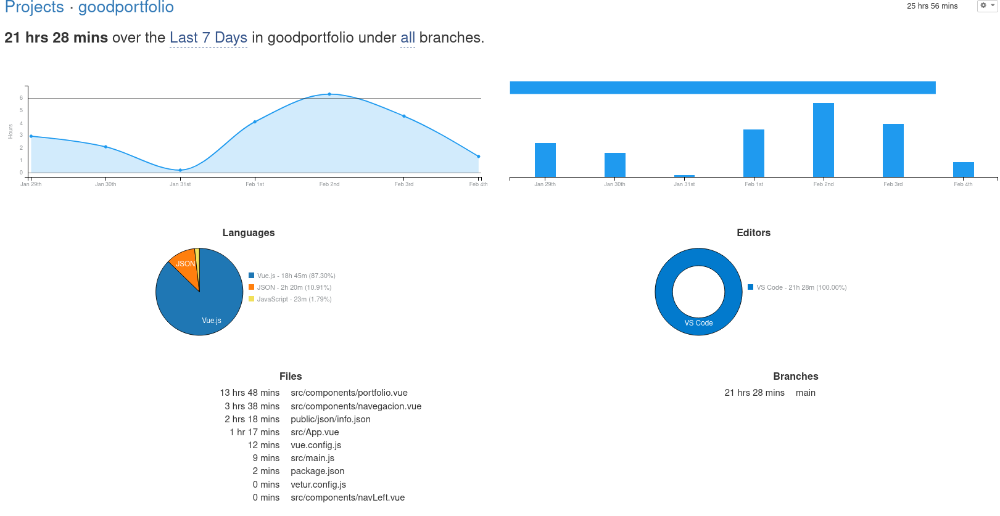

# Good Portfolio
This is my portfolio project, made in [Vue.js](https://vuejs.org/).

I have used:
- Vue JS
- BootStrap
- BootStrap-Vue
- Axios
- FontAwesome


## Web Production
[Production web]([https://link](https://javix64.github.io/vue-portfolio/dist/))

https://javix64.github.io/vue-portfolio/dist/


## Wakatime
More than 30h.



[wakatime url](https://wakatime.com/@8c413fb3-2356-4d3d-acf6-fbe71e974e55/projects/uixdcxcmxb?start=2021-01-30&end=2021-02-05)


# Steps

## Project setup
```
npm install
```

### Compiles and hot-reloads for development
```
npm run serve
```

### Compiles and minifies for production
```
npm run build
```

### Lints and fixes files
```
npm run lint
```

### Customize configuration
See [Configuration Reference](https://cli.vuejs.org/config/).
